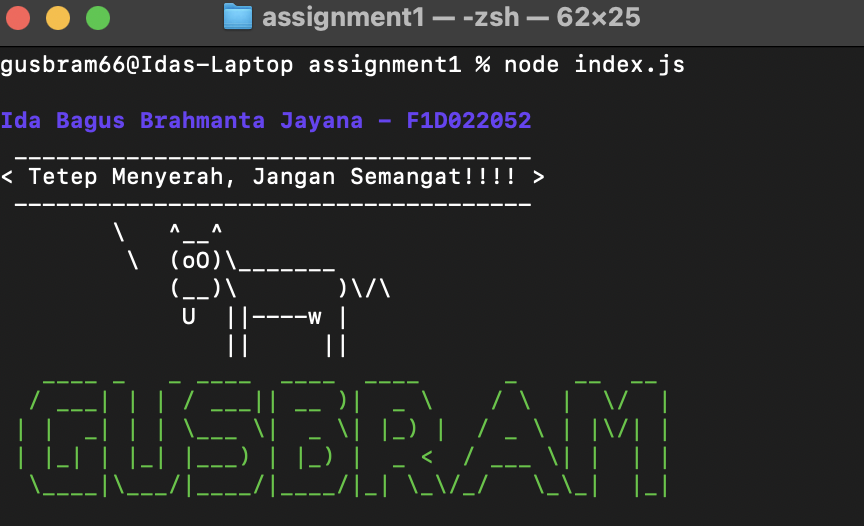

# Tugas 1 - Minggu 4  
## Node.js Plugins dengan Chalk, Cowsay, dan Figlet

Proyek ini dibuat untuk mempraktikkan penggunaan plugin Node.js: **chalk**, **cowsay**, dan **figlet**.  
Program akan menampilkan informasi mahasiswa, pesan motivasi, serta ASCII art di terminal.

---

## 📦 Dependensi
Package Node.js yang digunakan:
- [chalk](https://www.npmjs.com/package/chalk) – memberi warna dan gaya pada teks di terminal
- [cowsay](https://www.npmjs.com/package/cowsay) – menampilkan pesan dengan karakter sapi ASCII
- [figlet](https://www.npmjs.com/package/figlet) – membuat teks ASCII art

Tambahan (opsional untuk poin kreativitas):
- [gradient-string](https://www.npmjs.com/package/gradient-string) – membuat teks dengan gradasi warna
- [boxen](https://www.npmjs.com/package/boxen) – membuat kotak di sekitar teks
- [dayjs](https://www.npmjs.com/package/dayjs) – menampilkan tanggal dan waktu

---

## ⚙️ Langkah Instalasi Dependensi
1. Buka folder project atau buat folder baru.
2. Inisialisasi project Node.js:
   ```bash
   npm init -y
3. Install package utama:
   npm install chalk cowsay figlet
4. (Opsional) Install package tambahan:
   npm install gradient-string boxen dayjs
▶️ Cara Menjalankan Program
    Buka terminal pada folder project.
    Jalankan perintah berikut:
    node index.js
    Catatan: Jika menggunakan sintaks import, pastikan tambahkan "type": "module" di dalam file package.json.
    Jika menggunakan require, tidak perlu menambahkan.

🖼️ Screenshot Hasil Output
